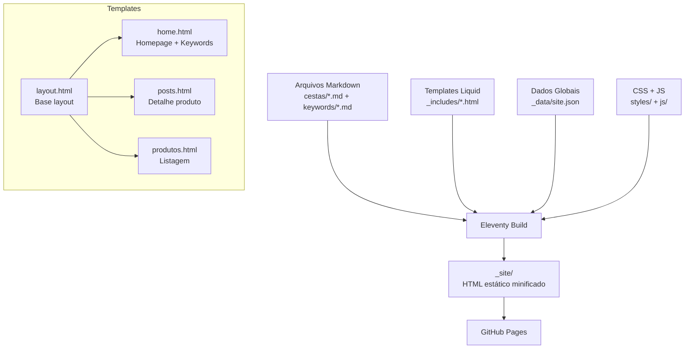
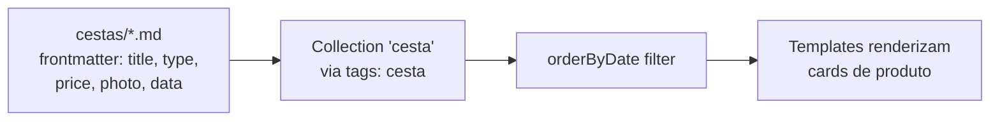

# Documento de Design

## Visão Geral

Este design detalha o redesign do site Memorare Cestas, transformando-o de um layout funcional básico para um site moderno, visualmente atraente e otimizado para SEO local. A arquitetura Eleventy (11ty) com templates Liquid é mantida, garantindo carregamento instantâneo via GitHub Pages. O design é inspirado no site afetoepoesias.com.br, que apresenta seções bem definidas: "Mais Pedidas" (carrossel de destaques), categorias visuais em grid, seção "Sobre Nós" com storytelling pessoal, e hierarquia visual clara.

As principais mudanças incluem:
- Homepage redesenhada com hero section, produtos em destaque, seção sobre, depoimentos
- Navegação com sticky header e menu hambúrguer mobile
- Página de produtos com filtro por categoria via JavaScript puro
- Analytics granular com eventos específicos por ação do visitante
- SEO local reforçado com schema markup expandido (LocalBusiness, Product, BreadcrumbList)
- Páginas de keyword SEO herdando automaticamente o novo visual

## Arquitetura

A arquitetura permanece como site estático Eleventy com deploy no GitHub Pages. Não há backend, banco de dados ou APIs externas (exceto Google Analytics/Ads).



### Fluxo de Dados dos Produtos



### Estrutura de Arquivos Modificados

```
_includes/
  layout.html          # Base layout (header, footer, analytics, schema)
  home.html            # Homepage + keyword pages layout
  posts.html           # Product detail layout
  partials/
    header.html        # Header com sticky + menu mobile
    footer.html        # Footer redesenhado
    testimonials.html  # Seção de depoimentos reutilizável
    product-card.html  # Card de produto reutilizável
    analytics.html     # Scripts de analytics
    schema.html        # Schema JSON-LD base
styles/
  style.css            # CSS redesenhado completo
js/
  index.js             # Menu mobile, filtro de categorias, analytics events
index.html             # Homepage
produtos.html          # Página de produtos com filtro
```

## Componentes e Interfaces

### 1. Layout Base (layout.html)

O layout base é o wrapper de todas as páginas. Ele inclui:
- `<html lang="pt-BR">` (corrigido de "en")
- Meta tags dinâmicas (title, description, Open Graph)
- Inclusão de partials: header, footer, analytics, schema
- Botão flutuante WhatsApp com animação de pulso

**Interface do template:**
```liquid
<!-- Variáveis esperadas do frontmatter -->
{{ pageTitle }}     <!-- Título da página para <title> e og:title -->
{{ description }}   <!-- Meta description e og:description -->
{{ photo }}         <!-- Imagem para og:image (opcional) -->
{{ permalink }}     <!-- URL canônica -->
```

### 2. Header (partials/header.html)

Header sticky com:
- Logo à esquerda
- Links de navegação: Início, Produtos, Sobre (âncora para seção na homepage)
- Ícone WhatsApp à direita (visível em desktop)
- Botão hambúrguer em mobile que abre/fecha menu overlay

**Comportamento JavaScript:**
```javascript
// Toggle menu mobile
document.querySelector('.menu-toggle').addEventListener('click', () => {
  document.querySelector('.nav-menu').classList.toggle('active');
});
```

### 3. Homepage (home.html / index.html)

Seções em ordem:
1. **Hero Section**: Fundo com gradiente escuro + imagem de cesta em destaque, título H1 "Cestas Artesanais em Conselheiro Lafaiete" com tipografia Calistoga, subtítulo emocional ("Transforme momentos especiais em memórias inesquecíveis"), CTA WhatsApp grande e chamativo, badge de localização
2. **Diferenciais/Confiança**: Faixa com 3-4 ícones + texto curto — "Feitas à mão com carinho", "Entrega em Conselheiro Lafaiete", "Ingredientes frescos e selecionados", "Embalagem que encanta" — gera confiança imediata
3. **Produtos em Destaque**: Título "Nossas Cestas Mais Pedidas", Grid 4 colunas (desktop) / 2 colunas (tablet) / 1 coluna (mobile) com os 4 produtos mais recentes, botão "Ver todas as cestas"
4. **Seção Sobre**: Layout 2 colunas (imagem + texto storytelling sobre o negócio Memorare Cestas, história pessoal, paixão pelo artesanal) — gera conexão emocional
5. **Depoimentos**: Cards de clientes com nome, estrelas e texto — prova social
6. **CTA Final**: Seção com fundo colorido, texto "Pronta para surpreender alguém especial?" e botão WhatsApp grande
7. **Contato**: Seção com ícones de localização, Instagram e WhatsApp

### 4. Página de Produtos (produtos.html)

- Título H1 com keyword local
- Filtro por categoria via botões/pills (JavaScript puro, sem reload)
- Grid de product cards com todos os produtos
- Seção highlights abaixo

**Filtro de categorias:**
```javascript
// Extrai categorias únicas dos data-attributes dos cards
// Filtra mostrando/escondendo cards com display: none/block
document.querySelectorAll('.filter-btn').forEach(btn => {
  btn.addEventListener('click', () => {
    const category = btn.dataset.category;
    document.querySelectorAll('.product').forEach(card => {
      card.style.display = (category === 'all' || card.dataset.type === category) 
        ? '' : 'none';
    });
  });
});
```

### 5. Página de Detalhe do Produto (posts.html) — Estilo Landing Page

Cada página de produto funciona como uma mini landing page projetada para gerar desejo e converter, inspirada em landing pages de SaaS:

**Estrutura da página (de cima para baixo):**

1. **Breadcrumb**: Início > Produtos > Nome do Produto (com schema BreadcrumbList)
2. **Hero do Produto**: Layout 2 colunas — imagem grande à esquerda com bordas arredondadas, à direita: nome (H1 com keyword local), categoria como badge, preço em destaque, CTA primário "Reservar pelo WhatsApp" (botão grande e chamativo)
3. **Seção "O que vem na cesta"**: Lista de itens formatada com ícones/checkmarks, visual limpo e escaneável — mostra o valor do produto
4. **Seção de Urgência/Confiança**: Badges de confiança — "Entrega em Conselheiro Lafaiete", "Pedidos com 24h de antecedência", "Aceitamos Pix, Cartão e Transferência", "Embalagem artesanal com carinho"
5. **CTA Secundário**: Repetição do botão WhatsApp após a lista de itens (o visitante não precisa rolar de volta)
6. **Depoimentos**: Seção reutilizada de depoimentos para prova social
7. **Produtos Relacionados**: Grid com 3-4 cestas da mesma categoria para cross-selling

**Técnicas de geração de desejo (inspiradas em landing pages SaaS):**
- Imagem grande e de alta qualidade como hero visual
- Preço em destaque com tipografia grande
- Lista de itens com checkmarks (✓) em vez de bullets simples — transmite valor
- Badges de confiança (entrega local, formas de pagamento)
- Prova social (depoimentos) próxima ao CTA
- Múltiplos CTAs na página (hero + após itens)
- Produtos relacionados para manter o visitante navegando

**Schema JSON-LD Product** com name, description, image, offers (price, currency, availability)

### 6. Product Card (partials/product-card.html)

Card reutilizável com:
- Imagem com border-radius e hover effect (scale + shadow)
- Nome do produto (H3)
- Categoria
- Preço
- CTA button

```liquid
<div class="product-card" data-type="{{ cesta.data.type }}">
  <a href="{{ cesta.url }}">
    
  </a>
  <div class="product-card__info">
    <h3>{{ cesta.data.title }}</h3>
    <p class="product-card__type">{{ cesta.data.type }}</p>
    <p class="product-card__price">{{ cesta.data.price }}</p>
  </div>
  <a href="https://wa.me/5531993434414?text=Vim do site e tenho interesse na {{ cesta.data.title }}" 
     class="btn btn--primary"
     onclick="trackWhatsAppClick('product', '{{ cesta.data.title }}')">
    RESERVAR
  </a>
</div>
```

### 7. Analytics (partials/analytics.html + js/index.js)

Eventos rastreados:
- `whatsapp_click`: com labels "floating", "hero", "product_{nome}", "footer"
- `view_item`: ao carregar página de produto, com nome do produto
- `view_item_list`: ao carregar página de produtos
- `filter_category`: ao clicar em filtro de categoria

```javascript
function trackWhatsAppClick(source, label) {
  gtag('event', 'whatsapp_click', {
    'event_category': 'engagement',
    'event_label': source + (label ? '_' + label : ''),
    'send_to': 'AW-980642221'
  });
}

function trackViewItem(productName) {
  gtag('event', 'view_item', {
    'event_category': 'ecommerce',
    'event_label': productName
  });
}
```

### 8. Páginas de Keyword SEO

As páginas de keyword continuam usando o layout `home.html`. Com o redesign do `home.html`, elas herdam automaticamente o novo visual. O frontmatter de cada keyword page fornece `title` e `description` customizados que são usados nos H1, meta tags e Open Graph.

**Nenhuma alteração nos arquivos `keywords/*.md` é necessária** — o redesign do template `home.html` é suficiente.

### 9. Estratégia de SEO Local Avançada

**On-Page SEO:**
- Cada página tem `<title>` único com keyword principal + "Conselheiro Lafaiete" + "Memorare Cestas"
- Meta description única por página com call-to-action e localidade
- H1 único por página com keyword principal
- H2s com variações de keywords (ex: "Cestas artesanais para café da manhã", "Presentes em Conselheiro Lafaiete MG")
- Atributos alt de imagens com keywords descritivas em português (ex: "Cesta artesanal de café da manhã em Conselheiro Lafaiete")
- Links internos entre páginas de produto e página de produtos

**Schema Markup Expandido:**

```json
// LocalBusiness (layout.html - todas as páginas)
{
  "@context": "https://schema.org",
  "@type": "LocalBusiness",
  "name": "Memorare Cestas",
  "description": "Cestas artesanais com entrega em Conselheiro Lafaiete MG",
  "image": "https://memorarecestas.com.br/imgs/Memorare - Cestas Artesanais - Conselheiro Lafaiete.webp",
  "url": "https://memorarecestas.com.br",
  "telephone": "+5531993434414",
  "email": "contato@memorarecestas.com.br",
  "address": {
    "@type": "PostalAddress",
    "streetAddress": "Rua José Anacleto da Rocha, 45 - Novo Horizonte",
    "addressLocality": "Conselheiro Lafaiete",
    "addressRegion": "MG",
    "postalCode": "36400-000",
    "addressCountry": "BR"
  },
  "areaServed": {
    "@type": "City",
    "name": "Conselheiro Lafaiete"
  },
  "sameAs": [
    "https://instagram.com/memorare.cestas"
  ]
}
```

```json
// Product (posts.html - páginas de produto)
{
  "@context": "https://schema.org",
  "@type": "Product",
  "name": "{{ title }}",
  "description": "{{ description }}",
  "image": "https://memorarecestas.com.br/imgs/{{ photo }}",
  "brand": { "@type": "Brand", "name": "Memorare Cestas" },
  "offers": {
    "@type": "Offer",
    "price": "{{ price_number }}",
    "priceCurrency": "BRL",
    "availability": "https://schema.org/InStock",
    "url": "https://memorarecestas.com.br{{ page.url }}"
  }
}
```

```json
// BreadcrumbList (posts.html - páginas de produto)
{
  "@context": "https://schema.org",
  "@type": "BreadcrumbList",
  "itemListElement": [
    { "@type": "ListItem", "position": 1, "name": "Início", "item": "https://memorarecestas.com.br/" },
    { "@type": "ListItem", "position": 2, "name": "Produtos", "item": "https://memorarecestas.com.br/produtos/" },
    { "@type": "ListItem", "position": 3, "name": "{{ title }}" }
  ]
}
```

**Open Graph Tags (todas as páginas):**
```html
<meta property="og:type" content="website">
<meta property="og:title" content="{{ pageTitle }}">
<meta property="og:description" content="{{ description }}">
<meta property="og:url" content="https://memorarecestas.com.br{{ page.url }}">
<meta property="og:image" content="https://memorarecestas.com.br/imgs/{{ photo | default: 'Memorare - Cestas Artesanais - Conselheiro Lafaiete.webp' }}">
<meta property="og:locale" content="pt_BR">
<meta property="og:site_name" content="Memorare Cestas">
```

## Modelos de Dados

### Produto (frontmatter de cestas/*.md)

```yaml
title: "Cesta Classic"                    # Nome do produto
pageTitle: "Cesta Artesanal de..."        # Title tag para SEO
tags: cesta                               # Tag para collection
type: "Café da manhã/tarde"               # Categoria
price: "R$ 185,00"                        # Preço formatado
photo: "Cesta Classic Cafe da manha..."   # Nome do arquivo de imagem
layout: posts                             # Template de detalhe
data: "06/05/2025"                        # Data para ordenação (DD/MM/YYYY)
```

### Keyword Page (frontmatter de keywords/*.md)

```yaml
title: "Cesta de Café da Manhã em Conselheiro Lafaiete"
description: "Desperte o dia com uma cesta..."
layout: "home.html"
permalink: "/cesta-de-cafe-da-manha-em-conselheiro-lafaiete/"
```

### Site Config (_data/site.json)

```json
{
  "url": "https://memorarecestas.com.br",
  "name": "Memorare Cestas",
  "phone": "+5531993434414",
  "whatsapp": "5531993434414",
  "instagram": "memorare.cestas",
  "email": "contato@memorarecestas.com.br",
  "address": {
    "street": "Rua José Anacleto da Rocha, 45",
    "neighborhood": "Novo Horizonte",
    "city": "Conselheiro Lafaiete",
    "state": "MG",
    "zip": "36400-000"
  }
}
```

### Categorias de Produto (derivadas dos dados existentes)

As categorias são extraídas dinamicamente do campo `type` dos produtos:
- "Café da manhã/tarde"
- "Natal"
- "Dia dos Namorados"
- "Kids"
- (outras conforme novos produtos)


## Propriedades de Corretude

*Uma propriedade é uma característica ou comportamento que deve ser verdadeiro em todas as execuções válidas de um sistema — essencialmente, uma declaração formal sobre o que o sistema deve fazer. Propriedades servem como ponte entre especificações legíveis por humanos e garantias de corretude verificáveis por máquina.*

As propriedades abaixo foram derivadas dos critérios de aceitação dos requisitos. Critérios visuais/CSS (responsividade, hover effects, paleta de cores) e critérios de performance (tempo de carregamento) não são testáveis como propriedades automatizadas e foram excluídos.

### Propriedade 1: Cards de produto contêm todas as informações obrigatórias
*Para qualquer* produto na coleção, seu card na página de produtos deve conter: imagem com atributo src válido, nome do produto, categoria (type), preço e link para a página de detalhes com URL correta.
**Valida: Requisitos 3.1, 3.3**

### Propriedade 2: Filtro de categorias exibe apenas produtos da categoria selecionada
*Para qualquer* categoria existente nos produtos, ao aplicar o filtro, apenas os produtos cuja categoria corresponde à selecionada devem estar visíveis (display !== 'none'), e todos os outros devem estar ocultos.
**Valida: Requisitos 3.2**

### Propriedade 3: Página de detalhe do produto contém todos os elementos obrigatórios
*Para qualquer* produto, sua página de detalhes gerada deve conter: imagem, nome (H1), categoria, preço, descrição com itens e link CTA para WhatsApp com mensagem pré-preenchida contendo o nome do produto.
**Valida: Requisitos 4.1, 4.2**

### Propriedade 4: Cliques em WhatsApp disparam evento de analytics com origem correta
*Para qualquer* botão de WhatsApp no site (flutuante, hero, produto, footer), o handler onclick deve chamar a função de tracking com o parâmetro source correto identificando a origem do clique.
**Valida: Requisitos 6.1**

### Propriedade 5: Páginas de produto disparam evento view_item com nome correto
*Para qualquer* página de produto gerada, o script de analytics deve conter uma chamada de evento "view_item" com o nome do produto correspondente ao frontmatter.
**Valida: Requisitos 6.2**

### Propriedade 6: Filtro de categoria dispara evento de analytics
*Para qualquer* ação de filtro por categoria, a função de tracking deve ser chamada com o nome da categoria selecionada.
**Valida: Requisitos 6.4**

### Propriedade 7: Botão flutuante de WhatsApp presente em todas as páginas
*Para qualquer* página gerada pelo site (homepage, produtos, detalhe, keyword), o HTML deve conter o elemento do botão flutuante de WhatsApp com link correto.
**Valida: Requisitos 7.3**

### Propriedade 8: Páginas de keyword renderizam com título e meta tags específicos
*Para qualquer* página de keyword, o HTML gerado deve conter o título da keyword no H1, no tag `<title>` e na meta description, correspondendo ao frontmatter do arquivo Markdown.
**Valida: Requisitos 8.1, 8.4**

### Propriedade 9: Páginas de keyword usam layout home.html
*Para qualquer* arquivo Markdown no diretório keywords/, o frontmatter deve especificar `layout: "home.html"` para herdar o visual redesenhado.
**Valida: Requisitos 8.2**

### Propriedade 10: Permalinks de keyword são preservados
*Para qualquer* página de keyword existente, o permalink no frontmatter deve corresponder ao slug gerado a partir do título, mantendo as URLs inalteradas.
**Valida: Requisitos 8.3**

### Propriedade 11: Nome da cidade presente em headings e meta descriptions
*Para qualquer* página gerada, o HTML deve conter "Conselheiro Lafaiete" em pelo menos um heading (H1 ou H2) ou na meta description.
**Valida: Requisitos 9.1**

### Propriedade 12: Meta tags Open Graph presentes em todas as páginas
*Para qualquer* página gerada, o HTML deve conter as meta tags og:title, og:description, og:url e og:image.
**Valida: Requisitos 9.3**

### Propriedade 13: Breadcrumbs com schema markup nas páginas de produto
*Para qualquer* página de produto, o HTML deve conter um schema JSON-LD BreadcrumbList com itens representando a hierarquia de navegação (Início > Produtos > Nome do Produto).
**Valida: Requisitos 9.5**

### Propriedade 14: Sitemap contém todas as páginas de produto e keyword
*Para qualquer* produto e *para qualquer* página de keyword, a URL correspondente deve estar presente no sitemap.xml gerado.
**Valida: Requisitos 9.6**

### Propriedade 15: Heading tags seguem hierarquia semântica
*Para qualquer* página gerada, os heading tags devem seguir hierarquia correta: deve existir exatamente um H1, e nenhum H3 deve aparecer sem um H2 precedente.
**Valida: Requisitos 9.7**

### Propriedade 16: Schema JSON-LD Product nas páginas de produto
*Para qualquer* página de produto, o HTML deve conter um schema JSON-LD do tipo Product com campos name, price (ou offers), description e image correspondendo aos dados do frontmatter.
**Valida: Requisitos 9.8**

### Propriedade 17: Imagens possuem atributos alt descritivos
*Para qualquer* tag `` no HTML gerado de qualquer página, o atributo alt deve estar presente e não vazio.
**Valida: Requisitos 10.2**

### Propriedade 18: Atributo lang="pt-BR" em todas as páginas
*Para qualquer* página gerada, o elemento `<html>` deve conter o atributo `lang="pt-BR"`.
**Valida: Requisitos 10.4**

## Tratamento de Erros

Como site estático, o tratamento de erros é limitado ao build time e ao JavaScript client-side:

### Build Time
- **Produto sem frontmatter obrigatório**: O Eleventy deve falhar o build se um produto não tiver title, type, price ou photo. Isso é garantido pela estrutura existente dos templates Liquid que referenciam essas variáveis.
- **Imagem não encontrada**: Imagens referenciadas no frontmatter que não existem em `imgs/` resultarão em links quebrados. O build não falha, mas a imagem não carrega.

### Client-Side (JavaScript)
- **Filtro de categorias**: Se nenhum produto corresponder à categoria (improvável com dados estáticos), o grid fica vazio. Nenhum tratamento especial necessário.
- **Menu mobile**: O toggle do menu usa classList.toggle, que é seguro mesmo se chamado múltiplas vezes.
- **Analytics**: Se o gtag não carregar (bloqueador de anúncios), as chamadas a `gtag()` falham silenciosamente. O JavaScript deve verificar se `gtag` existe antes de chamar:
  ```javascript
  function trackEvent(eventName, params) {
    if (typeof gtag === 'function') {
      gtag('event', eventName, params);
    }
  }
  ```

## Estratégia de Testes

### Abordagem Dual

O projeto utiliza testes unitários e testes baseados em propriedades de forma complementar:

- **Testes unitários**: Verificam exemplos específicos, edge cases e condições de erro
- **Testes de propriedade**: Verificam propriedades universais em todos os inputs válidos

### Framework de Testes

- **Linguagem**: JavaScript (Node.js) — mesma linguagem do projeto Eleventy
- **Framework de testes**: Vitest (leve, rápido, compatível com ESM)
- **Biblioteca de property-based testing**: fast-check (biblioteca PBT mais popular para JavaScript)
- **Abordagem**: Testar o output do build Eleventy (HTML gerado) em vez de testar templates isolados

### Configuração

- Cada teste de propriedade deve rodar no mínimo 100 iterações
- Cada teste deve referenciar a propriedade do design com comentário:
  `// Feature: site-redesign, Property N: [descrição]`

### Testes Unitários (exemplos e edge cases)

1. Homepage contém Hero Section com elementos obrigatórios (Req 1.1)
2. Homepage contém pelo menos 4 product cards (Req 1.2)
3. Homepage contém seção Sobre (Req 1.3)
4. Header contém logo, links de navegação e WhatsApp (Req 2.1)
5. Página de produtos dispara evento view_item_list (Req 6.3)
6. Evento de conversão genérico foi removido (Req 6.5)
7. Footer contém links, contato e redes sociais (Req 7.1)
8. Schema LocalBusiness contém todos os campos obrigatórios (Req 9.2)
9. HTML gerado é minificado (Req 10.3)

### Testes de Propriedade

Cada propriedade listada na seção de Propriedades de Corretude deve ser implementada como um teste de propriedade individual usando fast-check, com no mínimo 100 iterações por teste.
